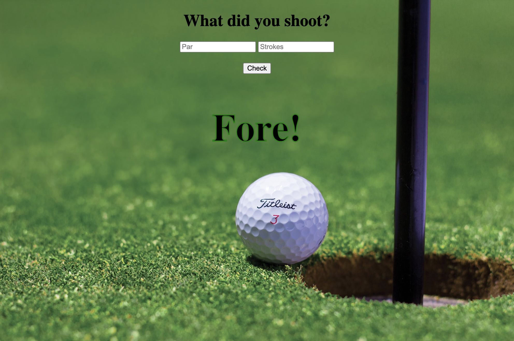

Golf Strokes

Learn what each number below/above par is called when finishing a hole!

Link to project: https://golf-strokes-app.netlify.app/

How It's Made: Basic application with a conditional that calculates what you shot on that hole based on par and strokes.  
Tech used: HTML, CSS, Javascript

Optimizations: Would love to bring in data on golf courses from an API at some point that would populate all the pars for holes.

Lessons Learned: How important it is to have a viewport tag in the header so the page isn't zoomed out on mobile.
